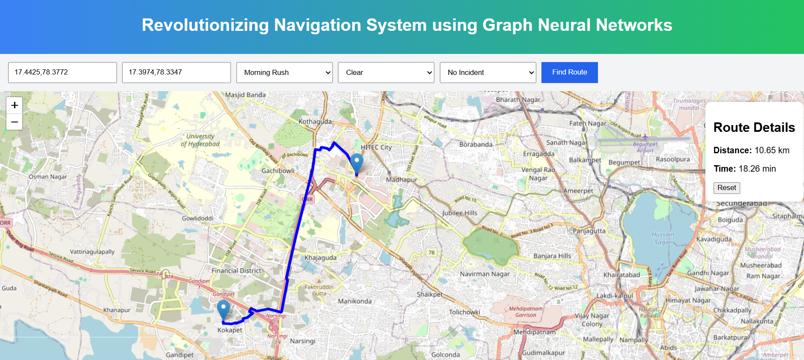

# Graph Neural Network-Based Traffic-Aware Route Optimization System

A Graph Neural Network (GNN)-based system that predicts road travel time and computes optimal routes under dynamic traffic, weather, and incident conditions using simulated urban mobility data built on real OpenStreetMap road networks.

---

##  Overview

This project builds a traffic-aware navigation system using **Graph Neural Networks (GNNs)** over a real-world road network extracted from OpenStreetMap (OSM).

Instead of relying only on traditional shortest-path algorithms like **Dijkstra’s or A\***, the system learns **dynamic edge weights (travel time)** using a trained GNN model.

The system is implemented and tested on the **Hyderabad West road network**, covering areas such as:
- Gachibowli  
- Financial District  
- Kokapet  
- Madhapur  
- Kondapur  

---

##  Features

-  Real-world road network using OpenStreetMap (OSMnx)
-  Rule-based traffic simulation
-  Graph Neural Network for edge-level travel time prediction
-  Dynamic edge weighting for routing
-  Shortest path computation using predicted weights
-  Context-aware routing (hour, weather, incidents, hotspots)
-  Focused on Hyderabad West traffic corridors

---

##  Tech Stack

- Python  
- PyTorch  
- NetworkX  
- OSMnx  
- Pandas  
- NumPy  

---

##  How It Works

### 1. Graph Creation
A road network graph is extracted using OpenStreetMap via OSMnx.

### 2. Feature Engineering
Nodes and edges are enriched with:
- Road type
- Geographic structure
- Traffic conditions

### 3. GNN Training
The model learns to predict:
> Travel time for each road segment (edge regression task)

### 4. Route Optimization
Predicted travel times are used as edge weights in:
- Dijkstra’s shortest path algorithm

---

##  Project Structure
project/
│
├── src/
│ ├── model.py
│ ├── train.py
│ ├── graph.py
│ ├── route_engine.py
│ ├── generate_dataset.py
│ ├── download_graph.py
│
├── data/
│ ├── hyderabad_west.graphml
│ ├── traffic_dataset.csv
│
├── models/
│ ├── gnn_model.pt
│
├── test_route.py
├── README.md

---

##  Results

The system demonstrates the ability to:

- Predict traffic-aware travel times for road segments  
- Adapt routes based on environmental conditions  
- Generate different routes for different traffic scenarios  

### Example Scenario:
- **Input:** Kokapet → Gachibowli  
- **Condition:** Evening rush + rain  
- **Output:** Alternative optimized route avoiding congestion zones  

---

##  Keywords

Graph Neural Networks, GNN, Route Optimization, Traffic Prediction, Intelligent Navigation, OpenStreetMap, OSMnx, Deep Learning, Edge Regression, Smart Transportation System, Smart Routing, Hyderabad Road Network, Dynamic Shortest Path

##  Results

---

##  Conclusion

This project demonstrates how **Graph Neural Networks can enhance traditional routing systems** by learning traffic-aware edge weights and enabling dynamic routing decisions on real-world road networks.